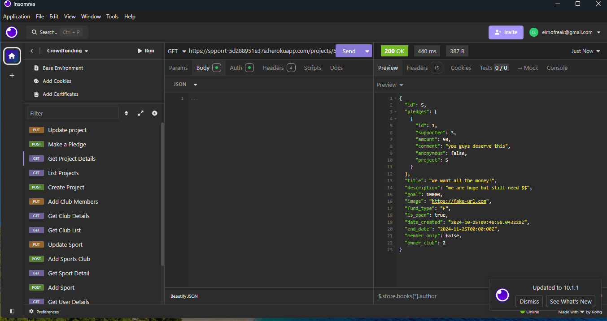
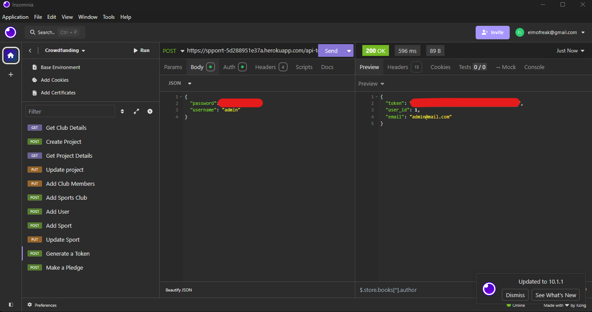

# cf_back_end
A repository for a django crowd funding back end in SheCodesPlus

# Crowdfunding Back End
Tenille Scott

## Planning:
### SPPORRT
A crowdfunding site for sports clubs to raise money for various activities or events.

### Intended Audience/User Stories
- Club owners can create a sports club - club location and club size to be specified:
  - ("S", "< 10 Members"),
  - ("M", "10-50 Members"),
  - ("L", "50-120 Members"),
  - ("XL", ">120 Members"),
- Club owners can create a project for their sports club - project purpose to be specified:
  - ("E", "Equipment and Uniforms"),
  - ("C", "Competitions and Events"),
  - ("F", "Players Fees"),
  - ("S", "Coaching"),
  - ("I", "Club Infrastructure")
- Club owners can add club members to their club
- Club owners can specify if pledges are only available to club members (this is useful for club events or coach gifts)
- Supporters can pledge a donation or contribution towards a project
- Club member supporters can pledge a donation or contribution towards a member-only project for their club.

### Front End Pages/Functionality
- Add a sport 
  - requires sport and sport-type (i.e. Field/Court/water/Athletics) #TODO make sport_type a selectable list
  - can only be added to and edited by admin users
- Add a user
  - requires username and password
- Get a token for a user
  - requires username and password
- Add a sports club 
  - requires club, description, sport from sport list, club_size from selectable list, club_location, is_active flag, club_logo, club owner (automatcially assigned to user making the club), club_members - optional, but will add creating user to the club_members.
- View a sports club and update details and members
  - currently only set up to add additional members #todo add functionality to delete members
  - sports club fields and club_members only editable by club_owner #TODO - fix this, currently permissions not working #TODO add club_admins with permissions
- Add a project
  - Projects should only be added by owner of a club - uses owner_club field for ownership #TODO - fix this, currently permissions not working
  - Requires title, description, goal, image, fund_type from selectable list, is_open, date_created (automatically set), end_date (#TODO add default to date_created + 30), member-only flag (#TODO add functionality to restrict pledging to club members of owner_club when this is = True), owner_club
- View and Edit a Project
  - Modifications to project should only be available to club_owner of owner_club #TODO fix permissions issues
- Make a Pledge
  - Requires amound, comment, anonymous flag, project, supporter automatically set to authenticated user
  - user must be authenticated
  - #TODO add functionality to restrict pledges where project flag member_only=True
- View and update Pledge
  - update restricted to supporter who owns the pledge (user)

### Deployed Site
https://spporrt-5d288951e37a.herokuapp.com/

### GET Methods

### POST Methods

### GET Token

### Register a new user and create a new project
1. Go to https://spporrt-5d288951e37a.herokuapp.com/users/ and create a POST method with the following input:
        {
		"username": "xx",
		"first_name": "xx",
		"email": "x@xx.com",
		"password": "xxxxxx"	
}
2. 

### API Spec

| URL | HTTP Method | Purpose     | Request Body | Success Response Code | Authentication/Authorisation |
| --- | ----------- | ----------- | ------------ | --------------------- | ---------------------------- |
| https://spporrt-5d288951e37a.herokuapp.com/users/    |      GET       |      Get a list of users    |       n/a      |              200         |            none                  |
| https://spporrt-5d288951e37a.herokuapp.com/users/    |      POST      |      add a user    |      {"username": "Bob","first_name": "Bob","email": "bob@email.com","password": "xxx"     |              HTTP_201_CREATED or HTTP_400_BAD_REQUEST       |            none                  |
| https://spporrt-5d288951e37a.herokuapp.com/api-token-auth/   |      POST       |      Get a User Token    |     {password":"xxx","username": "John"}     |              200         |            none                  |
| https://spporrt-5d288951e37a.herokuapp.com/users/(pk)   |     GET     |      Get User Details    |      n/a    |              200         |            none  |
| https://spporrt-5d288951e37a.herokuapp.com/sports/    |     POST    |      Add a Sport    |      {"sport": "Netball",	"sport_type":"Court"}   |              HTTP_201_CREATED or HTTP_400_BAD_REQUEST     |            Authorised User  |
| https://spporrt-5d288951e37a.herokuapp.com/sports/    |     GET    |      Get List of sports   |     n/a    |              200         |            none |
| https://spporrt-5d288951e37a.herokuapp.com/sports/(pk)   |  GET    |      Get Sports Details   |     n/a    |              200         |            none |
| https://spporrt-5d288951e37a.herokuapp.com/sports/(pk)   |   PUT   |      Update Sports Details   |    "sport" and/or "sport_type"   |              200 / HTTP_400_BAD_REQUEST        |            Admin User |
| https://spporrt-5d288951e37a.herokuapp.com/clubs/  |   POST  |      Create a New SportsClub   |   {"club": "John's HUGE Soccer Club",	"description": "The hugest Club in the World!",	"club_size": "XL","club_location": "NotPerth",	"is_active": "True",	"club_logo": "https://tinyurl.com/2krfmya8",	"sport": 2,	"club_members": []}  |              HTTP_201_CREATED or HTTP_400_BAD_REQUEST         |            Authenticated user |
| https://spporrt-5d288951e37a.herokuapp.com/clubs/  |   GET  |     Get list of Sports Clubs   |   n/a  |              200         |            none |
| https://spporrt-5d288951e37a.herokuapp.com/clubs/(pk)  |   GET  |     Get Sports Club Details  |   n/a  |              200         |            none |
| https://spporrt-5d288951e37a.herokuapp.com/clubs/(pk)  |   PUT  |    Update sports club or add members  |   any field(s)  |              200 / HTTP_400_BAD_REQUEST        |       Authorised user who is club_owner |
| https://spporrt-5d288951e37a.herokuapp.com/projects/  |  POST  |   Add a Project  |   {"title": "help us please","description": "we are tiny and need $$","goal": 2000,"image": "https://fake-url.com","fund_type": "F","is_open": "True","end_date": "2024-11-25","member_only": "False","owner_club": 1} |             HTTP_201_CREATED or HTTP_400_BAD_REQUEST         |       Authorised user who is club_owner |
| https://spporrt-5d288951e37a.herokuapp.com/projects/  |   GET  |     List Projects  |   n/a  |              200         |            none |
| https://spporrt-5d288951e37a.herokuapp.com/projects/(pk)  |   GET  |     Get Project Details |   n/a  |              200         |            none |
| https://spporrt-5d288951e37a.herokuapp.com/projects/(pk)  |   PUT  |     List Projects  |   any field(s)  |              200 / HTTP_400_BAD_REQUEST        |            Authorised user who is club_owner |
|  https://spporrt-5d288951e37a.herokuapp.com/pledges/ |   POST  |     Make a Pledge  |   {"amount": 50,"comment": "you guys deserve this","anonymous": "False","project": 5}  |              HTTP_201_CREATED or HTTP_400_BAD_REQUEST         |            Authorised user |
|  https://spporrt-5d288951e37a.herokuapp.com/pledges/ |   GET  |     Make a Pledge  |  n/a  |              200         |          none |
|  https://spporrt-5d288951e37a.herokuapp.com/pledges/(pk) |   GET  |     Get Pledge Detail  |   n/a  |              200         |            Authorised user |
|  https://spporrt-5d288951e37a.herokuapp.com/pledges/(pk) |   PUT  |     Update Pledge |   any field(s)  |              200 / HTTP_400_BAD_REQUEST        |            Authorised user who owns the pledge |
### DB Schema

